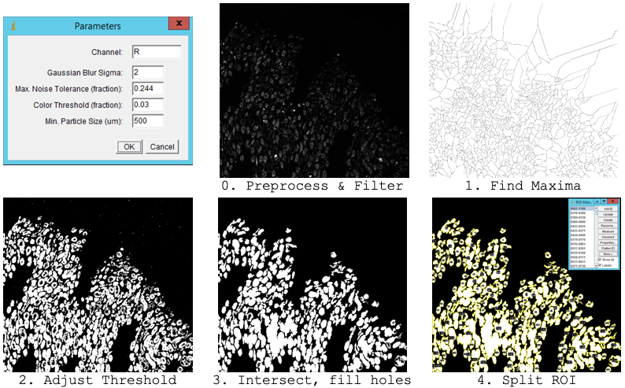
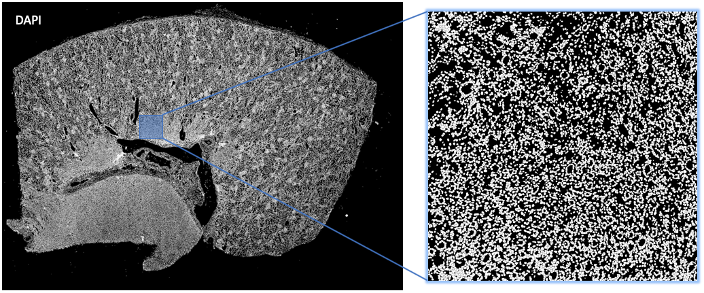

### fuzzy-lasagna
Spatial mapping of human kidney by automated structural segmentation and registration across paired IHC, AF, and IMS datasets

---
Download [QuPath](https://qupath.github.io/) for analysis of whole-slide IHC images. You will also need the [Bioformats Extension](https://github.com/qupath/qupath-bioformats-extension).  
QuPath scripts are found in `qupath_dev/`:  
* `.groovy` scripts run as QuPath macros
    * `Automate` > `Show Script Editor` > `File` > `Open...`
    * open script, then `Run`
* `.js` scripts are used in the ImageJ extension of QuPath
    * `Extensions` > `ImageJ` > `Export region to ImageJ`
    * in ImageJ: `Plugins` > `Macros` > `Run`

The general workflow for ImageJ and QuPath segmentation is as follows:  
  

Whole-slide MxIF image processed using `qupath_dev/tile_aggROI.groovy` > `qupath_dev/indivROI_save.groovy` yields binary TIFF for channel of interest.  
  
---
#### Python Implementation
```bash
pip install -r requirements.txt # make sure you have all necessary python packages
```
