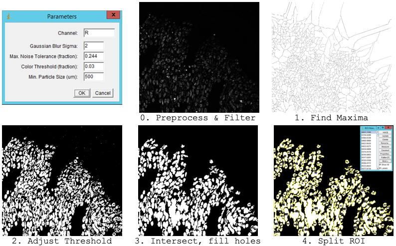
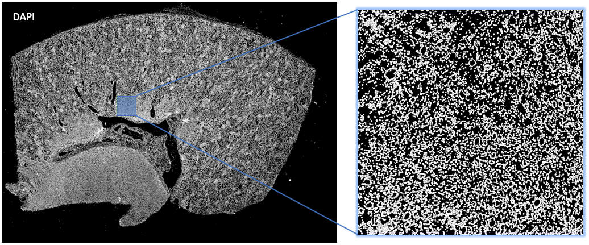

Segmentation Parameters
---
The following parameters were optimized for segmentation of structures labeled by each MxIF channel on whole-slide tissue section of human kidney.  

| Parameter       | Description                                                          | R (DBA) | G (LTL) | B (DAPI) |
| ---             | ---                                                                  | ---     | ---     | ---      |
| Sigma           | Pixel value for Gaussian blur filter                                 | 2       | 2       | 2        |
| Noise Tolerance | Fraction of total intensity as noise when identifying channel maxima | 0.244   | 0.183   | 0.006    |
| Threshold       | Minimum fraction of total intensity to keep in channel of interest   | 0.03    | 0.05    | 0.03     |
| Particle Size   | Minimum size in microns of resulting segments                        | 500     | 500     | 7.5      |
| ROI Split       | Minimum length of resulting ROI to split into multiple annotations   | 300     | 300     | 5        |

---

__Figure 2.__ Workflow as implemented in ImageJ and QuPath javascript macros

__Figure 3.__ Example binary mask output on DAPI channel of human kidney tissue section, labeling cell nuclei
